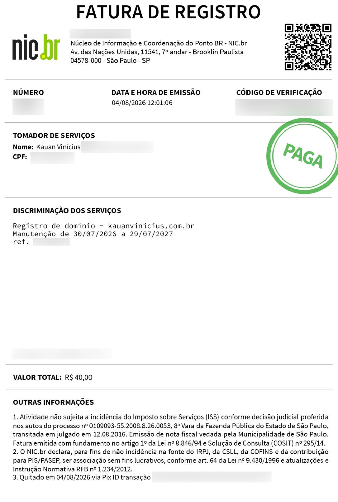

# Portfolio

###

This portfolio is **responsive**, adapting to any **screen size** for a better viewing experience. 

###

**<h2>Google Search Console</h2>**

###

This project is **prepared** for indexing on Google using **Google Search Console**.

###

- **GSC WebSite**: [https://search.google.com](https://search.google.com/search-console/about "Click to Access")
- **Render**: [https://render.com](https://render.com "Click to Access")
- **Official  URL**: [https://kauanvinicius.onrender.com](https://kauanvinicius.onrender.com "Click to Access")

###

**<h2>Features</h2>**

###

- Sending messages via `contact form`;
- **Validation** of required fields;
- Integration with `external service` for actual `email` sending;
- **Visual** feedback during message delivery.

---

- EmailJS: [https://www.emailjs.com](https://www.emailjs.com/ "Click to Access");

The **official EmailJS website** is automatically integrated into the `React` code through the `EmailJS` installation provided by `React` via the command:

Simply log in to the website and enter the **commands** used in the code into your devices.

###
```powershell
npm install emailjs
```

###
```ts
emailjs.send(serviceID, templateID, params)
```

###
```powershell
https://api.emailjs.com/api/v1.0/email/send
```

✅ This **without revealing** any `passwords`.

- **service__id**: xxxxxxxx;
- **template__id**: 00000000;
- **public key**: 123ABC456abc.

###
```powershell
http://localhost:3000
```

---

</img>
